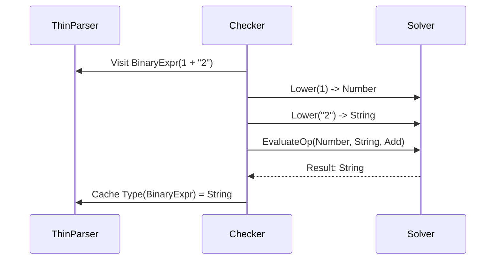

# WASM Compiler Architecture

---

## 🚨 URGENT: Critical Priorities Before Other Work

These items MUST be addressed immediately before continuing other tasks.

### 🚀 Track 1: Real-World Benchmarking (BLOCKING)

**Problem:** Current benchmarks use synthetic load, which is misleading for architecture decisions.

**Action Required:**
- [ ] Add a **Real-World Benchmark** using TypeScript's own source code (`src/compiler/*.ts`)
- [ ] Parse/Bind/Check the actual TypeScript compiler source files (e.g., `checker.ts` - ~50k lines)
- [ ] This will reveal the true cost of `Arc<str>` vs `Atom` and cache locality issues
- [ ] Measure: allocation pressure, L2 cache misses, parsing throughput

**Why TypeScript's Source?** We're already in this repo. Use `src/compiler/checker.ts`, `src/compiler/types.ts`, `src/compiler/parser.ts` as benchmark inputs. These are massive, real-world TypeScript files that stress-test every component.

```bash
# Benchmark command (to be implemented)
cargo bench --bench real_world -- --input ../src/compiler/checker.ts
```

**Target:** > 50 MB/s throughput (must beat TypeScript-Go ~40 MB/s)

---

## Core Design & Parsing Infrastructure

### 1. Architectural Philosophy
This compiler is designed specifically for **WebAssembly (WASM)** execution environments. Unlike traditional CLI compilers, it operates under unique constraints:
*   **Memory Latency:** WASM linear memory access can be slower than native heap access.
*   **Boundary Costs:** Crossing the JS-WASM boundary is expensive.
*   **Single-Threaded Context:** While Rayon is supported, the primary use case is often a single-threaded generic worker or main thread.

Therefore, the architecture follows **Data-Oriented Design (DOD)** principles rather than Object-Oriented Design. We prioritize **Cache Locality** and **Struct-of-Arrays (SoA)** layouts over pointer-chasing.

### 2. The Data Pipeline
The compilation process is a linear pipeline transforming source text into artifacts without intermediate object allocation overhead.


### 3. Memory Architecture: The "ThinNode" System

The core innovation of this compiler is the **ThinNode** representation. In traditional compilers (like `tsc` or `swc`), an AST node is a large struct or enum variant allocated on the heap, often exceeding 200 bytes. This ruins CPU cache locality.

#### 3.1. The 16-Byte Header
Every AST node is represented by a fixed-size, 16-byte header stored contiguously in a `Vec<ThinNode>`.

```rust
#[repr(C)]
pub struct ThinNode {
    pub kind: u16,        // SyntaxKind
    pub flags: u16,       // NodeFlags (Contextual info)
    pub pos: u32,         // Start position (u32 is sufficient for 4GB source files)
    pub end: u32,         // End position
    pub data_index: u32,  // Pointer to typed data pool (u32::MAX if none)
}
```

**Benefits:**
*   **Cache Density:** We fit **4 nodes per 64-byte CPU cache line**.
*   **Traversal Speed:** Scanning the AST structure without reading specific data is incredibly fast.
*   **Relocatability:** Nodes are referenced by `NodeIndex` (u32), not pointers. The entire AST can be serialized by just dumping the memory buffer.

#### 3.2. Typed Data Pools
Node-specific data (identifiers names, binary operators, function bodies) is stripped from the node and stored in separate, typed vectors called **Data Pools**.

| Node Category | Storage Pool | Data Layout (Example) |
| :--- | :--- | :--- |
| `Identifier` | `arena.identifiers` | `{ escaped_text: String }` |
| `BinaryExpression` | `arena.binary_exprs` | `{ left: NodeIndex, op: u16, right: NodeIndex }` |
| `Function` | `arena.functions` | `{ name: NodeIndex, params: NodeList, body: NodeIndex, ... }` |
| `IfStatement` | `arena.if_statements` | `{ expr: NodeIndex, then: NodeIndex, else: NodeIndex }` |

This effectively implements an **Entity Component System (ECS)** for the AST.

### 4. String Handling & Interning
Strings are the enemy of performance in WASM. To mitigate allocation costs:

1.  **Scanner Zero-Copy:** The scanner operates on a `&str` slice of the source. It does not allocate new strings for tokens unless requested.
2.  **Atom Interning:** Identifiers and Keywords are interned into a global `Interner`.
    *   Instead of passing `String`, we pass `Atom` (u32).
    *    Comparisons are `O(1)` integer comparisons.
    *   Memory usage is deduplicated.

### 5. The Parser Implementation
The parser (`thin_parser.rs`) is a recursive descent parser that constructs the `ThinNodeArena`.

*   **No Result<T, E>:** The parser never panics or returns `Result`. It recovers from errors immediately by creating "Missing" nodes or skipping tokens, pushing error data to a separate `diagnostics` vector.
*   **Lookahead:** Uses `Scanner::save_state()` and `restore_state()` for efficient, unlimited lookahead when grammar is ambiguous (e.g., distinguishing arrow functions from parenthesized groups).
*   **Incremental Ready:** Because nodes are indices, future incremental parsing can potentially reuse chunks of the indices array.


## Semantic Analysis (Binder, Solver, Checker)

### 1. The Binder: Scope & Symbol Management
The Binder (`thin_binder.rs`) is the first pass after parsing. Its sole responsibility is **Name Resolution**. It does not calculate types.

#### 1.1. Symbol Architecture
*   **SymbolArena:** All symbols are allocated in a contiguous `Vec<Symbol>`.
*   **SymbolId:** A lightweight `u32` handle.
*   **Node-to-Symbol Map:** A sparse map (`FxHashMap<NodeIndex, SymbolId>`) links declaration nodes to their symbols.

#### 1.2. Scoping Strategy
The Binder performs a single-pass walk of the AST to build the scope tree:
1.  **Scope Container:** Maintains a `ScopeChain` of active `SymbolTable`s.
2.  **Hoisting:** Pre-scans blocks to hoist `var` and `function` declarations before binding statements.
3.  **Flow Analysis:** Simultaneously builds a `ControlFlowGraph` (using `FlowNodeArena`) for later reachability and definite assignment analysis.

### 2. The Solver: Structural Type Engine
The Solver (`solver/`) is the "brain" of the compiler. Unlike traditional compilers that mix AST traversal with type logic, the Solver is a **pure type system engine**.

#### 2.1. Structural Interning
TypeScript uses a structural type system. To make this performant in WASM, we use **Type Interning**.
*   **TypeKey:** Describes the *structure* of a type (e.g., `Union([A, B])`, `Object({ x: Number })`).
*   **TypeInterner:** Maps `TypeKey` -> `TypeId` (u32).
*   **Deduping:** Identical structures (e.g., `{ x: number }` declared in two different places) map to the exact same `TypeId`.
*   **O(1) Equality:** Checking if `TypeA == TypeB` is just an integer comparison.

#### 2.2. The Logic Layers
The Solver is stratified into distinct logic layers:

| Layer | Component | Responsibility |
| :--- | :--- | :--- |
| **I/O** | `TypeResolver` / `Lowering` | Converts AST Nodes (`NodeIndex`) into `TypeIds`. |
| **Relations** | `SubtypeChecker` | Determines if `T1 <: T2`. Uses **Coinductive** logic to handle recursive types without infinite loops. |
| **Inference** | `InferenceContext` | Uses **Union-Find** (via `ena`) to solve generic constraints (`T extends U`). |
| **Operations** | `CallEvaluator` / `BinaryOp` | Pure logic functions: `(Type, Type, Op) -> ResultType`. |

#### 2.3. Lazy Diagnostics ("Check Fast, Explain Slow")
Type checking happens in hot loops. Formatting error strings is expensive.
1.  **Fast Path:** The solver returns simple Booleans or Enums (e.g., `Assignable`, `NotAssignable`).
2.  **Slow Path:** Only if a check fails, we invoke `explain_failure`. This reconstructs the failure chain (e.g., "Property 'x' is missing") and generates a `PendingDiagnostic` with raw data arguments. String formatting happens only at the very end of compilation.

### 3. The Checker: The Orchestrator
The Checker (`check/` module) acts as the **Facade** that connects the AST (Parser) to the Type System (Solver). It is refactored from a monolithic state machine into specialized handlers.

#### 3.1. Architecture
The Checker follows the **Visitor Pattern**, traversing the AST and validating rules.



#### 3.2. Responsibilities
*   **Expression Checking:** delegates to `Solver::evaluate`.
*   **Statement Checking:** Validates return statements against function signatures, checks control flow (unreachable code).
*   **Declaration Checking:** Validates implementation matches overloads, interface adherence.

### 4. Integration Summary
*   **Parser** creates `ThinNodes`.
*   **Binder** attaches `SymbolIds` to Nodes.
*   **Checker** asks **Solver** to compute `TypeIds` based on Nodes + Symbols.
*   **Solver** performs the math.

This separation allows unit testing the Solver logic (e.g., "Is `string | number` assignable to `string`?") without needing to parse a full source file.

## mission & Code Generation

### 1. The Emitter: Single-Pass Transpilation
The Emitter (`thin_emitter.rs`) converts the `ThinNode` AST into JavaScript source code. Unlike compilers that perform multiple AST-to-AST transformation passes (like Babel or SWC), this compiler performs **Print-Time Transformation**.

#### 1.1. Design Philosophy
*   **Zero Intermediate Allocations:** We do not generate a "High Level IR" or a "Low Level IR". We translate directly from the Read-Only Source AST to the Output String Buffer.
*   **Context-Aware Output:** The emitter maintains a state stack (`EmitContext`) to handle contextual syntax differences (e.g., `await` is only valid inside `async` functions).

### 2. The Writer Abstraction
To solve the complexity of generating Source Maps while transforming code, raw string buffering is wrapped in a `SourceWriter` abstraction.

```rust
pub struct SourceWriter {
    buffer: String,
    source_map: SourceMapGenerator,
    current_line: u32,
    current_col: u32,
}

impl SourceWriter {
    /// Writes text associated with a specific AST node.
    /// Automatically generates a mapping entry.
    pub fn write_node(&mut self, text: &str, node: &ThinNode) {
        self.source_map.add_mapping(self.current_line, self.current_col, node.pos);
        self.raw_write(text);
    }

    /// Writes syntax glue (keywords, parens) that doesn't map to source.
    pub fn write(&mut self, text: &str) { ... }
}
```

### 3. Transformations (Downleveling)
Since we don't mutate the AST, transformations are handled by delegating control to specialized **Transform Emitters**.

#### 3.1. Strategy: Delegation
When the main loop encounters a node that requires transformation (e.g., `ArrowFunction` when target is ES5), it hands control to a specific module.

*   **Native Emit:** `ArrowFunction` -> `(a) => a + 1`
*   **ES5 Transform:** `ArrowES5Emitter::emit` -> `function(a) { return a + 1; }`

#### 3.2. Implemented Transforms
The `transforms/` module contains isolated logic for complex rewrites:
1.  **Class Decomposition:** Converts `class` to IIFE + Prototype assignment + `__extends`.
2.  **Namespace Merging:** Converts `namespace` to IIFE closures.
3.  **Arrow Functions:** Captures lexical `this` by injecting `var _this = this;` in the parent scope and rewriting body references.

### 4. Source Maps
Source maps are generated simultaneously with emission.

*   **VLQ Encoding:** Optimized, allocation-free VLQ encoder writes directly to the mapping string.
*   **Granularity:**
    *   **High-Fidelity:** Identifiers, Literals, and Call Expressions map 1:1.
    *   **Low-Fidelity:** Complex transforms (like Class ES5) map the entire generated construct to the starting position of the original class node.

### 5. Runtime Helpers (`tslib`)
To keep output size small, repetitive logic is extracted into helpers.
1.  **Tracking:** The `HelpersNeeded` struct tracks which features are used during the emit pass (e.g., `extends`, `__awaiter`).
2.  **Injection:** At the end of emission, the required helpers are prepended to the output file (or imported if using external helpers).

### 6. Summary of the Full Pipeline

The complete lifecycle of a file through the WASM compiler:

1.  **Scanner:** `Source String` -> `Tokens` (Zero-copy).
2.  **Parser:** `Tokens` -> `ThinNodeArena` (16-byte structs).
3.  **Binder:** `ThinNodeArena` -> `SymbolTable` & `ScopeChain`.
4.  **Checker:** `Nodes` + `Symbols` -> `Solver` -> `Diagnostics`.
5.  **Emitter:** `Nodes` + `TransformLogic` -> `SourceWriter` -> `Output JS` + `.map`.

This architecture ensures that the compiler remains memory-efficient and cache-friendly, crucial for performance within the WebAssembly linear memory model.